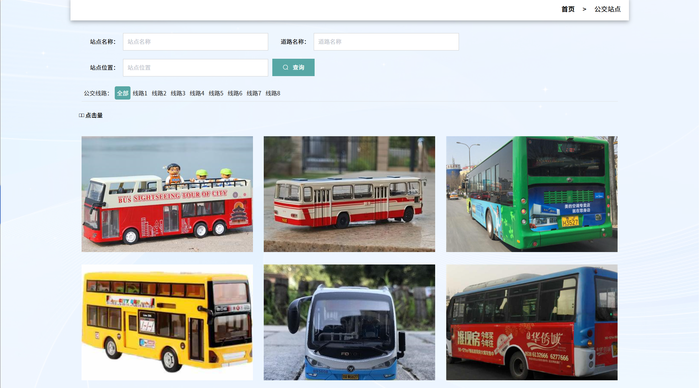

# springbootA410
springbootA410公交智能化系统+LW
 
## 查看主页获取源码

### 一、关键词

智能公交系统，公交自动化管理系统，智能公共交通运营系统

 

### 二、作品包含

源码+数据库+设计文档万字+全套环境和工具资源+部署教程

 

### 三、项目技术

前端技术：Html、Css、Js、Vue2.0、Element-ui 
后端技术：Java、SpringBoot2.0、MyBatis

  

 

### 四、运行环境（以下版本亲测，其他版本未知，请自测）

开发工具：IDEA/eclipse  + VSCODE

数据库：MySQL5.7（最低要5.7版本）

数据库管理工具：Navicat10以上版本

环境配置软件： JDK1.8 + Maven3.6.3

前端Nodejs：14

浏览器：谷歌浏览器

 

### 五、项目介绍

项目编号：springbootA410

由于广大用户对网络技术的需求也日益高涨，于是信息技术也需要继续开展全新的改革以满足时代的需求。根据此问题，研发一套公交智能化系统，既能够大大提高信息的检索、变更与维护的工作效率，也能够方便客户端的管理运用，从而减少信息管理成本，提高效率。
该公交智能化系统采用vue、SpringBoot架构技术，前端以网页页面呈现给用户，结合后台java语言使页面更加完善，后台使用MySQL数据库进行数据存储。该客户端主要设计并完成了管理过程中的用户注册登录、个人信息修改、公交线路、公交站点、公交信息等功能。该客户端操作简便，界面设计简洁，不但可以基本满足本行业的日常管理工作，同时又可以有效减少人员成本和时间成本，为城市公交查询管理工作提供了方便。

### 六、运行截图

